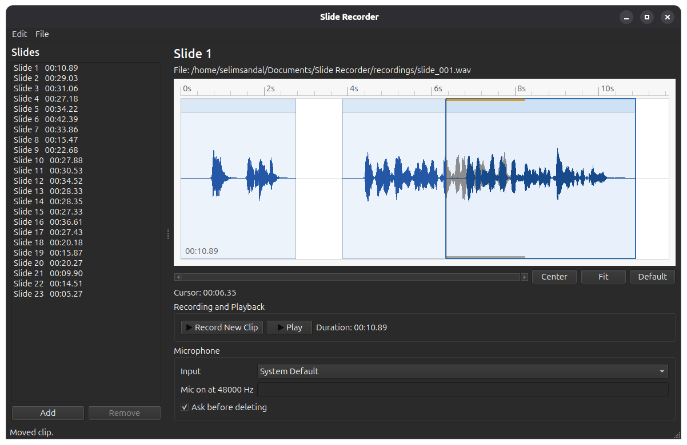

# Slide Recorder

<p align="center">
  <strong>Record slide voiceovers one take at a time, edit them on a timeline, and export clean audio or PDF-backed video.</strong>
</p>

<p align="center">
  
  
  
</p>

<!-- Add a screenshot at docs/screenshot.png. A 16:10 or 16:9 desktop capture works well. -->
<p align="center">
  
</p>
<p align="center"><sub>Screenshot placeholder: add <code>docs/screenshot.png</code>.</sub></p>

Slide Recorder is a native desktop app for building voiceovers slide by slide.
It keeps the microphone stream open after startup, so recording starts from an
already-running input stream instead of waiting for the device to wake up.

## Highlights

- Record each take as its own movable clip on a fixed-scale waveform timeline.
- Edit with selection handles, trimming, cutting, deletion, and Ctrl+Z undo.
- Layer overlapping clips intentionally: newer clips play over older clips, and
  priority can be changed from the waveform context menu.
- Add, rename, remove, and batch-select slides without showing slide content.
- Export the current slide as WAV, all recorded slides as a ZIP, or a PDF-backed
  MP4 video where each PDF page is timed to its slide audio.
- Runs on Windows, macOS, and Linux with Python, PySide6, and QtMultimedia.

## Quick Start

```bash
uv python install 3.12
uv sync
uv run slide-recorder
```

On Windows, run the same commands from PowerShell.

`uv` creates and manages the virtual environment. If you do not have it
installed, follow the official installer:
https://docs.astral.sh/uv/getting-started/installation/

The repository pins Python 3.12 in `.python-version`, while the package supports
Python 3.10 and newer.

By default, sessions are stored in `Documents/Slide Recorder`. A session contains
`session.json` plus a `recordings` directory with files like:

- `slide_001.wav` for the mixed slide audio
- `slide_001_clip_0001.wav` for an individual take

Local sessions, WAV exports, MP4 exports, and ZIP exports are ignored by git when
created in the repository while testing.

## Editing Flow

1. Pick a slide from the list.
2. Put the cursor where the next take should begin.
3. Click `Record New Clip`; the same button becomes `Stop Recording`.
4. Drag across the waveform to select a range, then adjust either edge or move
   the selected range.
5. Drag a clip header to move a whole take without changing its overlap priority.
6. Right-click the waveform for play, trim, cut, clear, delete, and clip priority
   actions.
7. Use Space for playback, Delete/Backspace for deletion, Escape to clear, and
   Ctrl+Z to undo the last audio edit for the current slide.

## PDF Video Export

Use `File > Export Slide Video from PDF...` to create an MP4 from the current
session.

The PDF must have the same number of pages as the session has slides. Page 1 is
paired with slide 1, page 2 with slide 2, and so on. Each page is rendered as a
still frame and held for that slide's recorded audio duration. Slides without
recordings can be included as one-second silent stills.

Video is encoded as 1920x1080 MP4 using the bundled `imageio-ffmpeg` executable,
so users do not need to install ffmpeg separately when running from source. The
exporter offers H.264/AVC, H.265/HEVC, and AV1 when supported by the bundled
ffmpeg build, trying hardware encoders first and falling back to software
encoding when needed.

## Packaging

Install the packaging extra:

```bash
uv sync --extra package
```

Windows/Linux:

```bash
uv run pyinstaller --name "Slide Recorder" --windowed --onedir --paths src packaging/pyinstaller_entry.py
```

macOS needs a microphone permission string in the app bundle:

```bash
uv run pyinstaller packaging/SlideRecorder.spec
```

Packaged builds are written under `dist/`.
